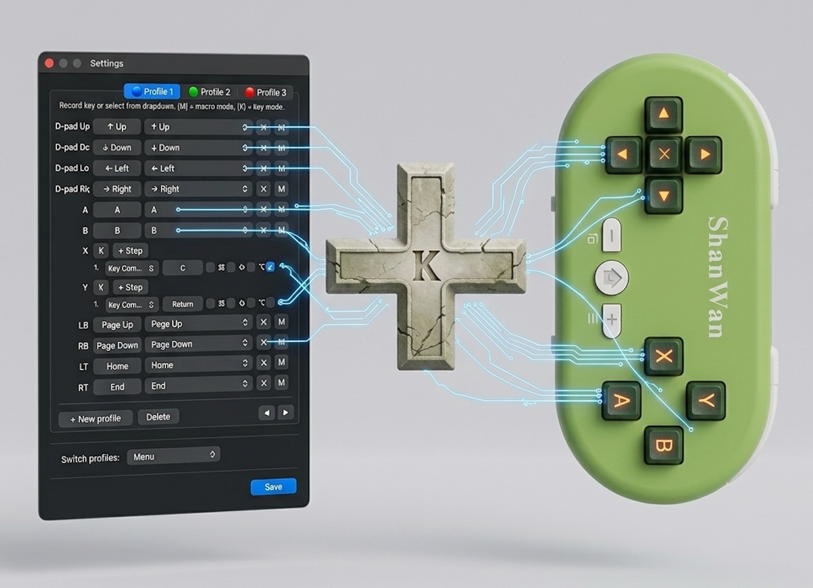

# Xbox As Keyboard

A simple menu bar app that maps your game controller buttons to keyboard keys. Install, launch, and it just works — sits in the tray, no setup needed. Free, open source, no bloat.

[](../../actions/workflows/build.yml)
[](LICENSE)
[]()

**[Download latest release](../../releases/latest)**



## Features

- Map any controller button to any keyboard key (record or pick from dropdown)
- Modifier keys (Cmd, Shift, Opt, Ctrl) — hold and combine with other keys
- Macros — chain key combos and text typing into one button press
- Multiple profiles with color indicators and instant switching via controller
- Works with Xbox, PlayStation, and any MFi-compatible gamepad
- Runs as a tiny menu bar icon — no dock clutter, no windows

## Install

Download the `.dmg` from the **[latest release](../../releases/latest)**, open it, drag to Applications.

On first launch: right-click the app > **Open** (required for unsigned apps). Grant Accessibility permission when prompted.

### Build from source

```bash
git clone https://github.com/user/macos-xbox-as-keyboard.git
cd macos-xbox-as-keyboard
make install
```

Requires macOS 13+ and Swift 5.9+.

## Default mappings

D-pad = Arrow keys, A/B/X/Y = A/B/X/Y, LB/RB = Page Up/Down, LT/RT = Home/End, Menu = Switch profile

All mappings are fully customizable in Settings.

## Contributing

See [CONTRIBUTING.md](CONTRIBUTING.md) for build instructions and dev setup.

## License

[MIT](LICENSE)
